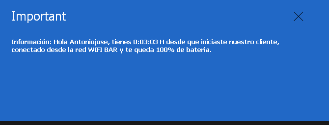
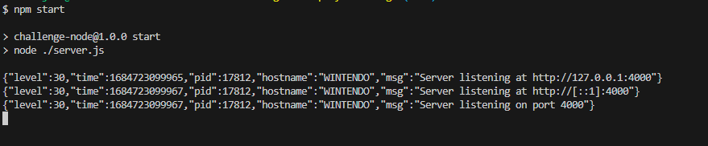

<div align="center"> <a href="https://fastify.io/">
    
  </a>
</div>
<div align="center">

[](https://nodejs.org/)
[](https://www.fastify.io/)
[](https://jestjs.io/)
[](https://cleancoders.com/)
[](https://www.ecma-international.org/)

</div>
# Desafío agente node

En este desafío, se requiere crear un servidor HTTP y un servidor Websocket que interactúen con el agente Prey instalado en tu computadora.

### Solución desarrollada con Fastify y Jest

Para abordar este desafío, se utilizó el framework Fastify para implementar el servidor HTTP y el servidor Websocket. Fastify es un framework web rápido y eficiente, especialmente adecuado para aplicaciones de alto rendimiento. Además, se utilizaron pruebas unitarias con Jest para asegurar el correcto funcionamiento de la solución.

### Implementación

El servidor HTTP implementa un endpoint que recibe un JSON con una instrucción. Esta instrucción se envía por Websocket al agente conectado al puerto `4000`, lo que permite mostrar una alerta en la pantalla del equipo utilizando la acción `Alert` de Prey. El endpoint retorna un status code `201` y un body con `content-type json`.

Para complementar la alerta con información dinámica, se recibe un mensaje desde el equipo hacia el servidor Websocket. Este mensaje contiene un atributo `type` igual a `device_status`. Con esta información, se genera un mensaje similar al siguiente ejemplo:

<div align="center">



</div>
### Requisitos implementados

1. Se implementó una estrategia de autenticación básica que verifica los valores de `api_key` y `device_key` almacenados en el archivo prey.conf. Las instrucciones solo se envían al agente si los valores coinciden con los almacenados estáticamente en el código.

2. Se realizó una validación para asegurar que el servidor solo permita un JSON con el formato especificado.

3. Se implementaron pruebas unitarias con Jest para verificar la autenticación, la respuesta de las solicitudes y otros aspectos del desarrollo.

### Librerías utilizadas

Se utilizaron las siguientes librerías para el desarrollo de la solución:

- Fastify: Framework web rápido y eficiente con buena implementacion de websocket.
- Jest: Framework de pruebas unitarias para JavaScript.

La solución cumple con los requisitos del desafío y se han realizado pruebas unitarias para garantizar el correcto funcionamiento de las funcionalidades implementadas.

## Preparacion ambiente
Es necesario tener instalado nodejs version 16 en primera instancia y ademas debes seguir las instrucciones del apartado [Requisitos](./docs/README.md#requisitos)
, una vez configurado y habiendo obtenido tu `device_key` y `api_key` debes crear un archivo `.env` en la raiz del proyecto, dicho archico debe contener las siguientes variables:

``` dotenv
    PORT=4000
    DEVICE_KEY=xxxxxx
    API_KEY=xxxxxxxxxxx
```

## Instalacion de dependencias

Para esto es necesario ejecutar el comando:
``` npm
    npm install
``` 
una vez todo este instalado correctamente solo nos queda inciar nuestra aplicación

## Iniciando el servidor

Para lograrlo solo hay que hacer uso del comando:
``` npm
    npm start
```

se deberia ver algo similar a esto:

<div align="center">



</div>
<br>
<br>
<br>

## License
<div align="center">

[](./LICENSE)
</div>