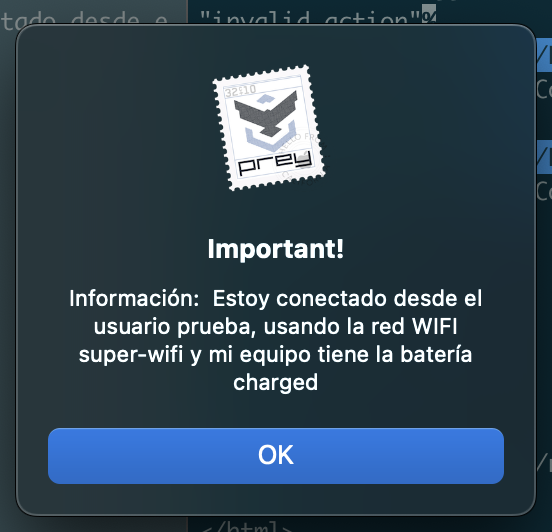

# Desafío agente node

En este desafío, se requiere crear un servidor HTTP y un servidor Websocket que interactúen con el agente Prey instalado en tu computadora.

### Solución desarrollada con Fastify y Jest

Para abordar este desafío, se utilizó el framework Fastify para implementar el servidor HTTP y el servidor Websocket. Fastify es un framework web rápido y eficiente, especialmente adecuado para aplicaciones de alto rendimiento. Además, se utilizaron pruebas unitarias con Jest para asegurar el correcto funcionamiento de la solución.

### Implementación

El servidor HTTP implementa un endpoint que recibe un JSON con una instrucción. Esta instrucción se envía por Websocket al agente conectado al puerto `4000`, lo que permite mostrar una alerta en la pantalla del equipo utilizando la acción `Alert` de Prey. El endpoint retorna un status code `201` y un body con `content-type json`.

Para complementar la alerta con información dinámica, se recibe un mensaje desde el equipo hacia el servidor Websocket. Este mensaje contiene un atributo `type` igual a `device_status`. Con esta información, se genera un mensaje similar al siguiente ejemplo:


### Requisitos implementados

1. Se implementó una estrategia de autenticación básica que verifica los valores de `api_key` y `device_key` almacenados en el archivo prey.conf. Las instrucciones solo se envían al agente si los valores coinciden con los almacenados estáticamente en el código.

2. Se realizó una validación para asegurar que el servidor solo permita un JSON con el formato especificado.

3. Se implementaron pruebas unitarias con Jest para verificar la autenticación, la respuesta de las solicitudes y otros aspectos del desarrollo.

### Librerías utilizadas

Se utilizaron las siguientes librerías para el desarrollo de la solución:

- Fastify: Framework web rápido y eficiente con buena implementacion de websocket.
- Jest: Framework de pruebas unitarias para JavaScript.

La solución cumple con los requisitos del desafío y se han realizado pruebas unitarias para garantizar el correcto funcionamiento de las funcionalidades implementadas.

## Preparacion ambiente

Seguir las instrucciones del apartado [Requisitos](#requisitos), una vez configurado y habiendo obtenido tu `device_key` y `api_key` debes crear un archivo `.env` en la raiz del proyecto, dicho archico debe contener las siguientes variables:

``` dotenv
    PORT=4000
    DEVICE_KEY=xxxxxx
    API_KEY=xxxxxxxxxxx
```

## Instalacion de dependencias

Para esto es necesario ejecutar el comando:
``` npm
npm install
``` 
una vez todo este instalado correctamente solo nos queda inciar nuestra aplicación

## Iniciando el servidor

Para lograrlo solo hay que hacer uso del comando:
``` npm
npm start
```

se deberia ver algo similar a esto:


<br>
<br>
<br>
<hr>

## INFORMACION INICIAL PROPORCIONADA!

<br>
<br>
<br>
# Desafío agente node

**Crear un servidor HTTP y un servidor Websocket que interactúe con el agente instalado en tu computador.**

### Requisitos
1- Crear cuenta en panel.preyproject.com si no la tienes.

2- Instalar Prey, para ello debes ir a https://preyproject.com/download y elegir la versión según tu sistema operativo.

3- Luego de instalar, debes abrir el archivo de configuración de Prey. Su ubicación depende del sistema operativo:

 - Windows: C:\Windows\Prey
 - Ubuntu/macOS: /etc/prey/prey.conf

4- En el archivo de configuración cambia las variables host y protocol (linea 30 y 33 respectivamente) y reinicia el cliente utilizando el comando `sudo pkill -f prx` en caso de Ubuntu/macOS y en Windows `taskkill /F /IM node.exe`.
Los nuevos valores son los siguientes:

- host = localhost:4000
- protocol = http

*Importante: comenta los valores originales para restablecerlos luego de finalizar el desafío.*

5- Reinicia el agente para que considere los cambios.

### Manos a la obra

El servidor HTTP debe implementar un endpoint que permita recibir un JSON con una instrucción, esta instrucción debe ser enviada por Websocket al agente conectado al puerto `4000` para así mostrar en la pantalla de tu equipo una alerta utilizando la acción `Alert` de Prey. El endpoint debe retornar un status code `201` y un body con `content-type json`.

El json a enviar es el siguiente: `{"action":"alert", "options": {"alert_message": "Información: "}}`

Este mensaje debe ser complementado con información dinámica enviada desde tu equipo hacía el servidor Websocket y generar un mensaje como el siguiente ejemplo:



La información para complementar la alerta proviene de un mensaje con el atributo `type` igual a `device_status`.


**Requisitos**

1- Implementar una estratégia de autenticación básica que considere los valores api_key y device key de tu archivo prey.conf. Sólo se deberán enviar las instrucciones al agente si los valores de tales variables son las mismas que almacenarás de forma estática en tu código.

2- Se debe validar que el servidor sólo permita un JSON con el formato especificado.

3- Se deben implementar pruebas unitarias de lo desarrollado (autenticación, respuesta de request, etc)

***Para realizar el desafío puedes utilizar las librerías que estimes convenientes.***