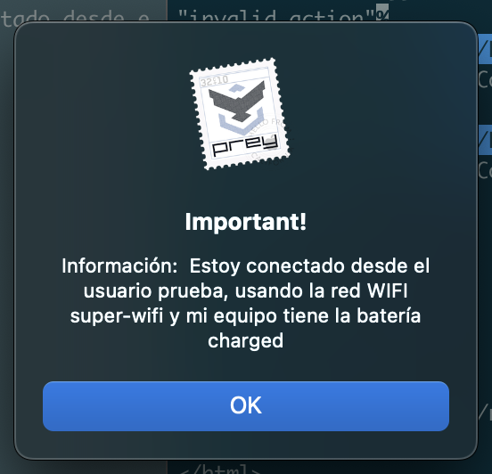

# Desafío agente node

**Crear un servidor HTTP y un servidor Websocket que interactúe con el agente instalado en tu computador.**

### Requisitos
1- Crear cuenta en panel.preyproject.com si no la tienes.

2- Instalar Prey, para ello debes ir a https://preyproject.com/download y elegir la versión según tu sistema operativo.

3- Luego de instalar, debes abrir el archivo de configuración de Prey. Su ubicación depende del sistema operativo:

 - Windows: C:\Windows\Prey
 - Ubuntu/macOS: /etc/prey/prey.conf

4- En el archivo de configuración cambia las variables host y protocol (linea 30 y 33 respectivamente) y reinicia el cliente utilizando el comando `sudo pkill -f prx` en caso de Ubuntu/macOS y en Windows `taskkill /F /IM node.exe`.
Los nuevos valores son los siguientes:

- host = localhost:4000
- protocol = http

*Importante: comenta los valores originales para restablecerlos luego de finalizar el desafío.*

5- Reinicia el agente para que considere los cambios.

### Manos a la obra

El servidor HTTP debe implementar un endpoint que permita recibir un JSON con una instrucción, esta instrucción debe ser enviada por Websocket al agente conectado al puerto `4000` para así mostrar en la pantalla de tu equipo una alerta utilizando la acción `Alert` de Prey. El endpoint debe retornar un status code `201` y un body con `content-type json`.

El json a enviar es el siguiente: `{"action":"alert", "options": {"alert_message": "Información: "}}`

Este mensaje debe ser complementado con información dinámica enviada desde tu equipo hacía el servidor Websocket y generar un mensaje como el siguiente ejemplo:

La información para complementar la alerta proviene de un mensaje con el atributo `type` igual a `device_status`.

**Requisitos**

1- Implementar una estratégia de autenticación básica que considere los valores api_key y device key de tu archivo prey.conf. Sólo se deberán enviar las instrucciones al agente si los valores de tales variables son las mismas que almacenarás de forma estática en tu código.

2- Se debe validar que el servidor sólo permita un JSON con el formato especificado.

3- Se deben implementar pruebas unitarias de lo desarrollado (autenticación, respuesta de request, etc)

***Para realizar el desafío puedes utilizar las librerías que estimes convenientes.***